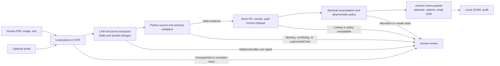

# Freight Invoice Exception Agent

**Customer:** Mid-market freight broker AP team  
**Goal:** Turn one invoice exception into a checked, human-approvable resolution.  
**Boundary:** Local LFM interprets document language; deterministic Python owns records, money, policy, and routing. No payment is executed.

| Stage | Owner and output | Failure handling |
|---|---|---|
| Intake | Local parser/OCR returns text with source and page provenance. | Unsupported, oversized, or uncertain input is held for review. |
| Extract | LFM calls only `submit_extracted_fields`; returns candidate fields and printed charges. It cannot query records or select a payment action. | One bounded repair; invalid or truncated output becomes review-required. |
| Verify and look up | Python checks extracted values against source evidence, then looks up PO, vendor policy, and paid state. | Missing/conflicting evidence or failed lookup cannot become a match. |
| Reconcile and route | Python uses `Decimal` for line totals and invoice-to-PO variance, applies currency/vendor/tolerance rules, and sets disposition. | Invalid facts, policy failures, and exceptions route to review; no auto-post. |
| Handoff | Python creates rationale and an email draft; optional LFM brief may compose only from approved sentences. Packet is written to local JSONL audit. | Template fallback or visible audit failure; a person must approve. Approval capture is not implemented. |

**Tool distinction:** Part 1 separately demonstrates LFM selecting a `lookup_purchase_order` tool and generating its argument. Part 2 intentionally uses a narrower model tool for extraction only; host Python invokes all business lookups and controls decisions.

**Evidence and limits:** Synthetic fixtures cover matching, tolerance edges, unknown PO, wrong vendor, underbilling, and prompt-injection cases. They test integration and defined controls, not real-world accuracy, production ROI, or an SLA. OCR is local preprocessing for a text model, not multimodal perception. See [README](README.md) for run instructions, measured results, assumptions, and next steps.