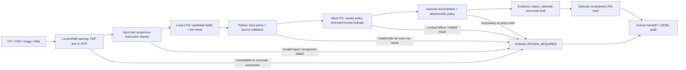

# Local invoice exception resolution for a mid-market freight broker

Presentation content for the Liquid AI Solutions Architect take-home, Part 2

This is a content bank for a roughly 15-minute presentation followed by 30 minutes of discussion. It follows the assignment's six “Bring to the session” sections. First-person passages can become speaking notes; the supporting tables and discussion answers can be used when building the deck later.

The central claim is: **a local language model can prepare a checked, explainable invoice-exception decision packet while deterministic code retains control of financial rules and a human retains approval authority.**

This document consolidates the customer story, multi-format demonstration, architecture, comparison results, economics and next steps. It is the presentation source of truth; the [repository README](README.md) is the practical guide for reviewing and running the code. Earlier text-fixture logs remain historical evidence and are distinguished from the newer format benchmark.

Evidence labels used throughout:

- **Implemented:** visible in the current repository.
- **Verified:** supported by recorded executions or regression tests.
- **Assumption:** an illustrative customer or commercial input requiring discovery.
- **Proposed:** a future capability or pilot target, not part of the running application.

Suggested time allocation: customer 2 minutes; demo 4; Liquid value proposition 2; architecture 3; validation 2; next steps 2. The detailed material is for preparation and discussion, not a script to read in full.

## Assignment coverage and session plan

The assignment asks for a 45-minute session with roughly 15 minutes of presentation and the rest for discussion. Use the six numbered sections as the main narrative; the appendices provide reproducible commands and supporting evidence.

| Assignment requirement | Where it is addressed | Demonstration or evidence |
|---|---|---|
| Specific customer/process; volume, loaded cost and SLA | Section 1 | Fictional mid-market freight broker; explicit economics and proposed one-business-day initial disposition |
| Working agent on LFM2.5-2.6B, from messy arrival to human-approvable resolution | Section 2 | PDF/image/EML intake, live extraction, mock lookups, reconciliation, draft and human packet |
| Real or carefully made synthetic artifacts; ideally a supplied exception | Section 2 | Six synthetic scenarios in four formats; original text/email case; stated input contract and new-file command |
| Liquid value proposition and model necessity | Section 3 | Local deployment rationale; division of model/code work; actual rules comparison and limits |
| Frontier-model escalation | Section 3 | Candidate future tasks; no automatic fallback; optional local larger-model benchmark |
| One-page architecture with input, output and failure handling for each stage | Section 4 | Diagram and stage contract, followed by technical backup |
| Untrusted input, including “ignore prior instructions” | Section 4 | Text, image and email-attachment attack cases; bounded capabilities and explicit limitations |
| Compounding reliability and human-in-the-loop constraints | Sections 4–5 | `0.95^6` example; validation, bounded repair, deterministic decisions and human handoff |
| Validation and what failed | Section 5 | Recorded multi-format comparison, regression evidence, failure history and measurement definitions |
| Next steps, real risks, how to retire them and assumptions dropped | Section 6 | Evidence-gated pilot plan, risk table and changed assumptions |
| Production ROI, broad accuracy and comparative superiority requested during the build | Sections 1, 3, 5–6 | Runnable scenario, observed comparison, explicit evidence gaps and pilot protocol |

## 1. The customer: a freight broker's AP exception queue

### The customer and the operational problem

> My customer is a mid-market freight broker whose accounts-payable team handles invoices from many carriers. The TMS—the transportation management system—holds the agreed load and purchase-order records, while carriers submit invoices with inconsistent headings, payee labels, charge descriptions, and follow-up emails.
>
> Standard invoices can follow existing matching rules. Exceptions still require a clerk to find the right invoice and PO, distinguish the carrier from the broker, check the totals, understand the disputed charge, and prepare the next action. The repetitive work is assembling trustworthy context before a person can make the decision.
>
> I built an assistant that performs that preparation locally and produces a packet the AP clerk can inspect. In this prototype, resolution means reaching a documented proposal or a specific review/information request. It does not mean paying the invoice or proving that a disputed charge is contractually owed.

**Northline Freight Brokerage is a fictional customer**, and ABC Logistics and the other vendors are synthetic. This is a realistic customer profile and artifact set, not a claim of a deployed customer or measured customer savings.

The example is plausible because the invoice carries the broker's name prominently, names a different carrier under “Remit to,” and adds a fuel surcharge to the agreed freight amount. The layout creates an extraction problem; the additional charge creates a policy and evidence problem.

### Who would buy, use, and approve the solution?

| Stakeholder | Concern | What I would validate in discovery |
|---|---|---|
| Controller or finance leader | Cost of exception handling, payment controls, auditability | Actual labor baseline, acceptable risk, approved exception policies |
| AP manager and clerks | Backlog, repeated lookups, unclear handoffs | Active handling time, reasons for escalation, usefulness of source evidence |
| Carrier operations/account management | Billing disputes and timely responses | Which missing documents resolve the most exceptions |
| IT/security and TMS owner | Data boundaries, integration, access, support | Available read APIs, deployment location, retention and access requirements |

A reasonable **proposed operational SLA** is an initial disposition within one business day, with an earlier cutoff for exceptions affecting the next payment run. That is a discovery hypothesis, not an existing contract or an SLA the demo proves. Vendor response time and final approval time are separate from model-processing time.

### An explicit, testable cost hypothesis

The assignment describes roughly eight minutes of human work per exception. I use that as an illustrative baseline and make the other assumptions visible.

| Input | Illustrative assumption |
|---|---:|
| Carrier invoices per month | 15,000 |
| Exception share | 20% |
| Exceptions per month | 3,000 |
| Current active handling time | 8 minutes per exception |
| Loaded AP labor cost | $45 per hour |
| Monthly exception-handling effort | 400 hours |
| Monthly loaded labor represented | $18,000 |
| Annual loaded labor represented | $216,000 |

Calculation: `15,000 × 20% × 8 ÷ 60 = 400 hours/month`; `400 × $45 = $18,000/month`.

These are **business-case assumptions**, not freight-industry benchmarks. The illustrative 20% exception share is also independent of the assignment's broad “easy 70%” framing.

My pilot hypothesis would be that the assistant prepares useful packets for 60% of this queue and reduces active human handling for those cases from eight minutes to three. The remaining 40% retain the full eight-minute effort. I do not count machine waiting time as eliminated human effort or assume that every case becomes automated.

| Share with a useful packet | Released human capacity/month | Gross monthly capacity value | Gross annual capacity value |
|---|---:|---:|---:|
| 30% | 75 hours | $3,375 | $40,500 |
| 60% | 150 hours | $6,750 | $81,000 |
| 80% | 200 hours | $9,000 | $108,000 |

All rows assume a five-minute reduction on covered cases. At 60% coverage: `3,000 × 60% × (8 − 3) ÷ 60 = 150 hours/month`.

This is **released capacity**, not a promised headcount reduction, and it is before infrastructure, integration, support, licensing, and residual review costs. The practical benefit may be absorbing more volume, reducing overtime, or responding to carriers sooner. Those outcomes need measurement.

**What would invalidate the business case?** A low exception volume, already-efficient handling, poor format coverage, or a reviewer who still has to redo every check. Discovery and a timed shadow pilot should answer those questions before a production rollout.

### Net economics and pilot measurement

```bash
python part2/roi.py --monthly-cost 1000 --setup-cost 10000
```

The default **assumptions** are 3,000 exceptions/month, eight minutes baseline human work, 60% usable assisted coverage, three minutes total human work on covered cases, and $45/hour loaded labor. Uncovered cases retain baseline effort. At illustrative recurring cost $1,000/month and setup cost $10,000, the calculation gives 150 hours/month freed, $6,750 gross monthly capacity value, $5,750 net monthly capacity value, and $59,000 first-year net capacity value. These cost inputs are examples, not measured operating costs. Capacity value becomes cash savings only if the organization can actually avoid spending or redeploy capacity productively. Extra handling on uncovered cases would reduce the result and must be included in pilot inputs/costs.

Use [pilot_measurements.csv](part2/pilot_measurements.csv) to capture actual human effort and outcome; the empty template is not evidence. Include waiting/SLA separately from hands-on minutes. Compute acceptance and error rates across the whole queue, not only documents the model accepted. Measure total cost per correct, accepted resolution. Keep money movement outside the experiment.

[Recorded scenario inputs/output](review/roi-scenario.json) preserve the example calculation. A negative result is possible when review effort or operating costs exceed the benefit; the calculator does not assume positive returns.

## 2. The demo: from arrival to a human-reviewable outcome

### The case to show first

> An invoice from ABC Logistics asks for $12,450 against PO-4821, which contains $12,000. The invoice includes $12,000 of line haul and a $450 fuel surcharge. A vendor email asks for the full amount and explains that the additional $450 is a fuel surcharge.
>
> The system must distinguish two questions. First, do the printed line items add up to the invoice total? They do. Second, does that invoice total fit the purchase order and the configured tolerance? It does not: the difference is $450 and the demo's tolerance is $100.
>
> The result is a proposed $12,000 short payment, pending human approval and backup for the variance. The system has identified and organized the exception; it has not decided that the surcharge is invalid or settled a contractual dispute.

The $100 tolerance and the short-pay proposal are **explicit mock business policies chosen for this assignment**. They are not universal AP rules. A real customer's policy owner must define the permitted actions, thresholds, and supporting documents.

### What the audience should inspect

| Step | What appears in the demo | What it demonstrates |
|---|---|---|
| Arrival | Actual PDF/image or EML attachment; original text/email example also available | Realistic synthetic documents enter a local conversion boundary before model extraction |
| Extraction | Correct carrier, invoice ID, PO, currency, amount, and line items | Local LFM converts language into candidate structured facts |
| Evidence | Converted source lines, source hashes and OCR/page trace | Python checks candidate facts against converted text; the reviewer can compare them with the original file |
| Backend interaction | PO, vendor/policy, and paid-invoice lookup results | Actual Python mock functions execute |
| Reconciliation | Line total `12450.00`; PO `12000.00`; delta `450.00`; tolerance `100.00` | Code performs the financial comparisons |
| Disposition | `HUMAN_APPROVAL_REQUIRED` and `short_pay` | Business policy controls the recommendation |
| Handoff | Rationale, clerk brief, email draft, audit status | A person can inspect the facts and proposed next action |

The email is **context and a source of detectable conflicts**. It cannot overwrite invoice facts, authorize an extra charge, or change the tolerance. The current implementation checks recognizable references, amounts, and currencies; it does not claim general understanding of every possible email dispute.

### Run the end-to-end example

With the existing local llama-server running, use Cursor's integrated terminal:

```bash
# Run from the repository root.
curl --max-time 5 http://127.0.0.1:8080/health

.venv/bin/python part2/run_mvp.py \
  --invoice part2/artifacts/invoice_001.txt \
  --email part2/artifacts/vendor_email_001.txt
```

Expected important output:

```text
Status:       HUMAN_APPROVAL_REQUIRED
Exception:    amount_mismatch
Action:       short_pay
Auto-post:    False
Extraction trace: status=ok
Brief trace:  status=generated
Audit:        written

invoice_amount: 12450.00
po_amount:      12000.00
amount_delta:    450.00
tolerance_usd:   100.00
line_items_match: true
```

In the saved full run, extraction took 15.88 seconds and brief composition took 15.85 seconds—31.73 seconds across the two model requests. This is **model-request time**, not a measured human handling time, queue SLA, or precise end-to-end latency. [Recorded invoice/email execution](review/fixed-invoice-email.log)

### Show that “resolved” includes a safe hold

For the live presentation, follow the main case with the injection fixture. It runs without inference because the known attack is intercepted before model or backend work:

```bash
.venv/bin/python part2/run_mvp.py --case prompt_injection --no-brief
```

For the complete fixture demonstration or discussion:

```bash
.venv/bin/python part2/run_mvp.py --case all --no-brief
```

| Case | Expected disposition | Human meaning |
|---|---|---|
| Amount mismatch | `HUMAN_APPROVAL_REQUIRED` / `short_pay` | A validated proposal is available; approve or revise it |
| Unknown PO | `HUMAN_REVIEW_REQUIRED` / `request_information` | Obtain a valid PO or supporting rate confirmation |
| Vendor mismatch | `HUMAN_REVIEW_REQUIRED` / `escalate` | Resolve the payee discrepancy before considering payment |
| Prompt injection | `HUMAN_REVIEW_REQUIRED` / `escalate` | Investigate suspicious document instructions |
| Matched invoice | `HUMAN_APPROVAL_REQUIRED` / `approve_match` | Checks passed, but a human still authorizes any payment |

**Important explanation:** `approve_match` is a recommendation. `Human: approve, edit, escalate` lists the intended reviewer choices; the CLI does not capture an approval event. No payment function or email-send function exists. The audit records preparation of the packet, not human authorization.

### Show actual document formats

The primary external input is a document file, not a pre-extracted JSON invoice. Local MIME/PDF/OCR ingestion converts it into source text for the text-only LFM. The output is a packet containing extracted facts and supporting text, mock record lookups, computed mismatches, a proposed action or hold, an email draft, and an audit record. Successful file ingestion also retains paths, hashes and page/OCR details.

After the setup in Appendix A, show the original file alongside its packet:

```bash
python part2/run_mvp.py --invoice part2/artifacts/multiformat/overcharge.pdf --no-brief
python part2/run_mvp.py --invoice part2/artifacts/multiformat/matched.png --no-brief
python part2/run_mvp.py --invoice part2/artifacts/multiformat/unknown_scan.pdf --no-brief
python part2/run_mvp.py --invoice part2/artifacts/multiformat/wrong_vendor.eml --no-brief
```

| Arrival | Expected exception/action | Intended human outcome |
|---|---|---|
| Overcharge native PDF | `amount_mismatch / short_pay` | Consider the proposed PO amount and request variance backup |
| Matched PNG invoice | `matched / approve_match` | Review the checked invoice before authorizing anything |
| Unknown-PO scanned PDF | `unknown_po / request_information` | Obtain the missing purchasing reference |
| Wrong-vendor email with attached PDF | `vendor_mismatch / escalate` | Investigate carrier identity before payment |

`--no-brief` skips only optional LFM prose composition; extraction still uses LFM. Its checked template is the expected brief in the recorded paired benchmark. Omit the flag to demonstrate the optional generated brief. The earlier text/email example above demonstrates that path separately.

The corpus has **24 files, six business scenarios and three closely related template variants**. Every scenario appears as a native PDF, PNG, image-only scanned PDF and email with a PDF attachment. The PNGs are clean rendered invoices, not real phone photographs; the scans do not simulate real-world degradation. The artifacts explicitly identify themselves as synthetic. The assignment's PDF/photo/email examples motivate the intake boundary, without requiring every conceivable format.

For the attack demonstration, also run:

```bash
python part2/run_mvp.py --invoice part2/artifacts/multiformat/injection.eml --no-brief
```

The known malicious instruction lives inside the attached invoice. The recorded CLI run reads that attachment, flags the attack, skips LFM extraction, writes an audit and produces `HUMAN_REVIEW_REQUIRED`. Full-corpus rules evaluation also covers its PNG and scanned-PDF variants.

**Why this is a valid assignment demo:** it reads realistic external artifacts, uses LFM2.5-2.6B for candidate extraction, executes mock backend tools, computes the discrepancy, and reaches an inspectable proposal or explicit review request. These are the requested steps from arrival to a human-reviewable resolution. It does not demonstrate autonomous payment, universal document handling or production ROI. The complete paired benchmark and its limitations appear in Section 5.

### If the interviewer supplies a new exception

I would first state the current input contract: TXT, native PDF, PNG/JPEG, image-only scanned PDF, or plain-body EML with one invoice attachment. Local OCR converts pixels to text before LFM extraction. The business checks still require labeled payees/totals, supported identifiers, USD policy and nonnegative cent amounts. Mixed PDF layers, uncertain OCR and ambiguous attachment bundles are held. The combined text limit is 24,000 characters.

A supported new invoice can be supplied through `--invoice`:

```bash
python part2/run_mvp.py --invoice /path/to/interviewer_invoice.pdf --no-brief
# For a separate companion text email:
python part2/run_mvp.py --invoice /path/to/interviewer_invoice.pdf --email /path/to/email.txt --no-brief
```

For an EML containing exactly one invoice attachment, pass the EML itself as `--invoice`. If it is ambiguous or unsupported, the correct demonstration is the review-required result and its reason. The packet retains source hashes, converted text and OCR details. Evidence against OCR text does not establish that the original pixels were read correctly; a reviewer must still inspect the source.

Keep the saved output available as a clearly labeled prior execution if the server is unavailable. Do not present replayed output as a new live result.

## 3. The Liquid value proposition: local language processing for repetitive private work

**Current comparison finding:** the new paired test passed all four documents for both LFM and a capable rules baseline. Median pipeline time was 48.591 seconds for LFM and 0.973 seconds for rules. The full rules run passed 24/24 format variants. This demonstrates local integration, not LFM superiority; the labeled synthetic corpus is too regular to establish incremental language-model value. The full results and comparison method are in Section 5.

### Why this workload is a credible Liquid fit

> This workload combines repetitive volume, commercially sensitive documents, and a narrow language task. It does not require an open-ended expert to invent the business policy. It needs a model that can turn varied invoice wording into a small set of candidate facts inside the customer's environment.
>
> LFM2.5-2.6B is a plausible fit because the deployment and capability profile match that task. The project demonstrates local inference with a small model, and the rest of the workflow is deliberately ordinary Python. The value proposition is the ability to prepare useful decisions within the customer's data boundary at a cost and operational footprint we can measure.

Liquid describes LFM2.5-2.6B as a text model designed for on-device deployment, with agentic post-training and support for extraction and tool use. Its official model card also provides a GGUF version for llama.cpp. Those are reasons to evaluate it here; they are not substitutes for application-level evidence. [Liquid model card](https://huggingface.co/LiquidAI/LFM2.5-2.6B/blob/main/README.md)

| Value proposition | What this prototype demonstrates | What still needs validation |
|---|---|---|
| Data locality | Inference is directed to `http://127.0.0.1:8080/v1`; the SDK uses a dummy local key and no cloud fallback | Production egress controls, access policy, retention, encryption and audit handling |
| Repeated-volume economics | The application does not incur a cloud inference API charge per request | Hardware utilization, electricity, support, integration, model licensing and cost per accepted packet |
| Deployment flexibility | Local llama.cpp serves the configured `lfm2.5-2.6b` model | The actual customer hardware, concurrent load, recovery and operational ownership |
| Appropriate capability | Recorded runs extract the tested invoice facts and prepare reviewed proposals | Generalization across unseen carriers and layouts; comparison with simpler approaches |
| Operational control | The application exposes extraction failures, retries, brief fallback and audit outcomes | Central monitoring, incident procedures, durable queues and version rollback |

Locality reduces the need to transmit invoice data to an external inference provider. It does **not** mean the workstation is air-gapped, that plaintext audit files are secure by default, or that the solution is automatically compliant. Those controls remain deployment work.

Liquid publishes hardware-specific inference results, but I would not put those numbers forward as this application's measured speed. My evidence is the recorded application requests, whose latency varies materially. [Liquid deployment announcement](https://www.liquid.ai/blog/lfm2-5-2-6b)

### How I would defend the model choice

I would compare three approaches on the same held-out documents and the same policy rules:

| Approach | Reason to consider it | Main evaluation question |
|---|---|---|
| Rules/templates only | Potentially sufficient for stable labeled documents; low operational complexity | How much of the actual queue does it cover without template maintenance or errors? |
| Local LFM plus deterministic checks | Handles language variation while keeping inference inside the deployment boundary | Does it increase useful coverage enough to justify compute and support? |
| Customer-approved larger model | May help with genuinely difficult document interpretation | Does quality improve enough to justify latency, cost and any approved change in data handling? |

The rules baseline actually passed all 24 synthetic format variants and matched LFM on the four paired cases. **I have not demonstrated that LFM beats rules on the customer's document population.** Creating image inputs does not itself establish language-model necessity: OCR can make an invoice readable by either method.

The validator currently expects recognizable labels, identifiers and same-line evidence. That supports strict checking, but narrows accepted documents to a family rules can often handle. To test incremental language value, collect real cases requiring interpretation of varied charge descriptions, ambiguous references or relationships across supporting documents. Define independently reviewable evidence for those tasks and expand validation alongside extraction. Do not weaken the rules baseline or cherry-pick documents to manufacture a model win.

The defensible Liquid claim today is a demonstrated local deployment pattern. Data locality is useful but not unique to Liquid, and lower operating cost remains a hypothesis requiring measurements.

### Which steps genuinely need language?

| Step | Owner today | Justification |
|---|---|---|
| Interpreting invoice labels and identifying commercial fields/charge descriptions | LFM | Candidate language task: wording and layout vary |
| Checking copied facts against recognizable source lines and email references | Python | A checkable relationship should be enforced explicitly |
| PO/vendor/payment lookups | Python | These are record retrieval operations |
| Arithmetic, tolerance, currency/vendor comparison and routing | Python | Business rules must be reproducible and inspectable |
| Vendor email draft | Python template | The communication is narrow and its numbers/actions should be fixed |
| Clerk brief | Optional LFM composition from approved sentences | Demonstrates local language composition, but adds limited business value in the current narrow flow |

The final point is worth stating directly: **I would not defend optional brief generation as necessary to this MVP.** It may be disabled with `--no-brief`; the checked packet remains useful. The model cannot freely rewrite amounts or actions. Future free-form summarization would need a concrete reviewer benefit and separate validation.

### What would go to a frontier model?

The normal resolver does not escalate to another model; its implemented escalation target is a human. The separate benchmark supports an opt-in, already-running larger local model. That comparison has not been run, and it is not an automatic fallback.

A future, explicitly authorized larger-model path could be evaluated for ambiguous multilingual narratives, complex relationships across several documents, or unusual layouts that a broader intake system can actually ingest. The current local OCR path handles clean raster invoices; difficult scans need separate OCR evaluation. A larger text model alone does not recover visual evidence missing from the converted text.

The larger model would still return candidate facts, pass the same business checks, and have no payment authority. It should not be used to guess a missing PO, resolve a vendor-master discrepancy without evidence, override a tolerance, or replace approval of a contract exception. Its hosting location and any data transfer would require the customer's authorization; there is no silent fallback.

## 4. Architecture: one-page input, output and failure contract

### The architecture to put on one page



The handoff is a packet, not an executed approval. Invalid brief generation falls back to the deterministic brief with a visible trace. An audit-write failure changes the returned status to review-required and reports that persistence failed.

| Stage | Input | Output | Failure handling |
|---|---|---|---|
| 1. Intake and instruction screening | TXT/PDF/image/EML | Converted text, hashes, page and OCR trace | Unreadable/uncertain conversion, unsupported bundles, oversized input or recognized injection produce review-required |
| 2. Local extraction | Untrusted source text; extraction tool schema | Invoice ID, PO, payee, currency, amount, line items; optional notes | Exactly one expected tool call is required; missing, malformed or truncated output fails validation |
| 3. Validation and evidence | Candidate facts plus converted source text | Checked values with supporting source lines | Reject missing/invalid facts, conflicting recognized references and unsupported evidence; at most one repair, then review |
| 4. Mock backend retrieval | Validated IDs/payee | PO, vendor policy and paid-invoice result | Validate returned records and identifiers; missing records route to a specific hold/request; invalid responses/exceptions require review |
| 5. Financial and policy checks | Checked invoice and backend records | Decimal totals/delta, match flags and deterministic disposition | Holds for vendor/currency/policy issues, paid/inactive PO, missing/inconsistent items or out-of-tolerance underbilling |
| 6. Resolution and audit | Disposition, facts and evidence | Human packet, deterministic email draft, optional constrained brief, timestamp/packet ID/audit | No model payment action; unacceptable brief falls back visibly; audit error is surfaced and requires review |

**The most important boundary is between candidate model facts and business decisions.** The model may suggest a PO identifier; it cannot decide to skip its lookup. It may extract a number; it cannot choose the tolerance or authorize payment.

### Document ingestion and source fidelity: architecture backup

| Stage | Output | Failure handling and reason |
|---|---|---|
| MIME parsing | Plain body, subject, one invoice attachment | Multiple attachments and HTML-only email are held. The system must not silently choose an invoice or omit a supporting document. No remote content is fetched. |
| Native PDF reading | Page text | Empty text triggers OCR. Encrypted PDFs and files outside limits are held. |
| Raster reading | OCR text, word/line boxes and engine confidence | Minimum recognized-box confidence below 0.8 triggers review. This is an uncalibrated conservative gate, not an accuracy probability. High confidence does not establish correct digits or detect omitted text. |
| Mixed text/image PDF | OCR plus preserved native layer in audit | Held for visual review because either layer can omit or contradict content. This includes some otherwise ordinary logo-bearing PDFs; coverage is deliberately limited. |
| Candidate extraction | Five critical invoice fields and printed charges | Existing source validation applies equally to LFM and the rules baseline. It checks converted text, which cannot prove OCR correctness against pixels. |
| Reconciliation | Signed difference, policy checks, proposed action | Python owns arithmetic and authority. Unknown/conflicting facts stay in review. |
| Handoff | Source paths and SHA-256 hashes, exact converted text, page/OCR traces, field evidence, lookup results, rationale, draft and audit ID | Reviewers must compare important amounts and identity with the original file. The CLI exposes packet choices; it does not implement an approval UI or record a payment authorization. |

The limits are 10 MiB per document, five pages per PDF, 24,000 combined text characters, and bounded subprocess calls. These are demo limits, not a hardened upload service. Full converted text and OCR boxes now enter the local audit log: production retention, access controls and source-file storage remain deployment work. Unsupported documents should be held visibly, not interpreted as successfully reconciled.

### What each file owns

| File | Responsibility |
|---|---|
| [run_mvp.py](part2/run_mvp.py) | CLI, file input, printed packet and fixture evaluation |
| [ingestion.py](part2/ingestion.py), [ocr.m](part2/ocr.m) | MIME parsing, native PDF reading, local OCR and source provenance |
| [benchmark.py](part2/benchmark.py), [roi.py](part2/roi.py) | Shared-check extraction comparison and explicitly assumed economics |
| [agent.py](part2/agent.py) | Local model calls, bounded repair, orchestration, routing, brief controls and audit |
| [validation.py](part2/validation.py) | Type/value checks, source evidence, recognizable document conflicts and printed-item checks |
| [backends.py](part2/backends.py) | In-memory records, lookups, Decimal arithmetic and email templates |
| [test_agent.py](part2/test_agent.py) | Offline regression tests and controlled failure scenarios |

Part 1's [tool_test.py](part1/tool_test.py) is a separate tool-calling experiment. It is not the execution engine for Part 2.

In Part 2, the LFM tool call is `submit_extracted_fields`; the host Python code calls `lookup_purchase_order`, `lookup_vendor`, `lookup_paid_invoice`, `compute_mismatch`, and `draft_vendor_email`. This is a **bounded agent workflow with deterministic orchestration**, not an autonomous planner choosing arbitrary backend actions. That is an intentional answer to the reliability requirement.

### Financial rules the presenter should be ready to explain

- Money is parsed with `Decimal`; invalid, boolean, negative, nonfinite, over-range and sub-cent values are rejected rather than rounded into acceptable facts.
- Vendor matching uses normalized exact names and explicit aliases. It does not accept a shorter substring such as “Logistics” as proof of identity.
- Paid invoices are looked up within a vendor; a paid PO is also held even if the submitted invoice number differs.
- Both invoice and PO currency must exist and agree. The mock tolerance policies are USD-specific; there is no foreign-exchange conversion.
- Printed invoice lines must sum to the invoice total before a proposal can be approval-ready. **There is no full invoice-line-to-PO-line matching:** the mock POs contain aggregate amounts, not unit-price/quantity line records.
- Within-tolerance cases recommend the invoice amount for approval. Overbilling beyond tolerance proposes the PO amount pending approval. Underbilling beyond tolerance requires review rather than recommending that payment be increased to the PO amount.
- Unknown PO or vendor holds may be selected before missing-item/policy checks. The packet can contain several failed flags, while its primary disposition gives the first relevant reason to act.

The displayed `confidence` is a hardcoded policy label associated with disposition, **not a calibrated model probability**. It should not be used as a production approval threshold.

### Prompt injection: demonstrate both layers

> The documents are written by outside parties. A sentence on an invoice cannot become a system instruction just because a language model reads it.
>
> I use explicit untrusted-input instructions and screen for known attack phrases, but those are only supporting controls. The architectural protection is that the model has no payment tool, Python performs the lookups and policy decisions, and an approval-ready packet still requires a human.

The bundled attack asks the agent to ignore instructions, avoid tools and approve payment. The current implementation detects it before inference, returns `HUMAN_REVIEW_REQUIRED`, and produces a hold draft. Therefore the demonstration proves the **deterministic interception of this known attack**; it does not prove that LFM resisted every injection instruction.

Remaining risks are important. A paraphrased attack may escape the phrase detector. Malicious source text may contain internally consistent but false commercial facts. Showing that a number occurs in a document does not establish that the document is authentic. Source checks reduce unsupported extraction; trusted vendor records, actual business evidence and a human decision are still necessary.

The brief writer receives approved sentences rather than raw invoice notes or email instructions. Its output must contain the mandatory status/rationale/approval text and only approved sentences. This prevents the displayed brief from adding a new payment instruction through unrestricted prose, while preserving a visible deterministic fallback.

## 5. Validation: what the evidence proves, what failed, and reliability compounding

### Start with the reliability question

> Six independent steps that are each 95% correct have a joint success probability of `0.95^6`, or about 73.5%. I use that as an illustration of why a chain of plausible model answers is not enough. It is not a measured reliability estimate for this system, and real errors are often correlated.
>
> My response was to reduce the number of probabilistic decisions and make uncertain outputs stop at validation boundaries. LFM proposes fields. Python checks source support, retrieves records, computes the amounts, and selects the route. Optional generation cannot change that route. A failed model call produces a human-review packet instead of an apparently successful financial recommendation.

Deterministic code can also be wrong, and a gate can reject a correct document. The architecture improves inspectability and contains errors; it does not mathematically guarantee correctness or prove high coverage. Reliability must be evaluated jointly with appropriate escalation and useful throughput.

### Recorded multi-format results

The frozen corpus comprises 24 synthetic files derived from six business cases, with three related template variants. Four different cases, one per format, were used for the live LFM comparison. All variants of an invoice are correlated; 24 files do not constitute 24 independent business examples. These are development regression fixtures, not unseen customer documents.

| Evaluation | Exact five-field extraction | Correct status, exception and action | Incorrect proposals observed | Median pipeline time |
|---|---:|---:|---:|---:|
| Rules, complete corpus | 20/20 eligible files | 24/24 files | 0 | 0.190 seconds |
| Rules, paired format smoke set | 4/4 | 4/4 | 0 | 0.973 seconds |
| LFM2.5-2.6B, same paired set | 4/4 | 4/4 | 0 | 48.591 seconds |
| Larger local model | Not run | Not run | Not measured | Not measured |

The four injection variants intentionally skip extraction, so they are excluded from the full-corpus field denominator. Five-field agreement means invoice ID, PO ID, vendor, total and currency all equal the independently specified fixture facts. It does not measure every line-item description, pixel-level OCR transcription, email quality or adjudicated commercial correctness. Zero observed incorrect proposals in a small sample is not a zero production error rate.

The paired cases were an overcharge PDF, matched PNG invoice, unknown-PO scanned PDF, and wrong-vendor email with a PDF attachment. Every method uses identical ingested text, source validation, mock records, deterministic policy and a template brief. Native PDFs use pypdf; images and scanned PDFs use local Apple Vision. The four LFM pipeline times were approximately 20.37, 36.75, 79.63 and 60.44 seconds.

Timing includes each document's ingestion, extraction, policy and audit. Ingestion ran once per paired case and its cost was attributed to both methods. The full rules run was also active during part of the live run, and other local activity was not controlled. These timings describe this execution; they are not isolated hardware benchmarks, p95 estimates or production SLAs. Model alias and platform are captured in the reports; weights checksum, quantization, power and memory measurements were not captured.

Evidence: [paired raw report](review/multiformat-paired.json), [full rules report](review/multiformat-rules.json), [52 passing regression tests](review/multiformat-tests.log), [email-attachment injection CLI run](review/multiformat-cli-injection.log), and [frozen labels and file hashes](part2/artifacts/multiformat/manifest.json). Reports retain packets, converted text and traces, including failures if a future run encounters them.

### Comparison method and interpretation

The generator creates explicit gold facts/routes and SHA-256 hashes before evaluation. The benchmark verifies those hashes. It never supplies labels to either extractor. Rebuilding the corpus changes the manifest and invalidates comparisons to old reports.

Both candidates receive the **same conversion result**, use the same source validator, mock backend, policy and deterministic brief. The rules baseline searches generic labels and table rows, with no fixture identifiers or hardcoded invoice facts. It is intentionally capable on supported labeled layouts. This measures the incremental value of extraction, not a full autonomous larger-model agent. It does not establish that either candidate is best among all prompt or regex designs.


No larger model is downloaded or called by default. Remote endpoints are rejected. Results are saved after each document/method, including failures, so an interrupted run remains inspectable. Compare methods only on the same completed document IDs. The harness returns nonzero when any expected route fails; that is useful experimental evidence rather than a reason to discard the run.

Metrics include exact agreement on each of five critical fields, agreement on all five together, exact status/exception/action route, proposal count, incorrect proposals, and per-format results. Injection cases intentionally skip extraction and are excluded from the field denominator. Pipeline time includes ingestion plus extraction, policy, deterministic briefing and audit; ingestion is performed once and its measured cost attributed equally. There is no concurrency or repeated-trial latency characterization. Do not infer p95, throughput, hardware cost, or statistically significant superiority from this smoke test.

Benchmark commands are in Appendix A.

### Regression and historical evidence

| Evidence | Observed result | What it supports | What it does not establish |
|---|---|---|---|
| Offline regression suite | 52 test methods passed, including ingestion and ROI cases | Tested arithmetic, validation, routing, failure and output-control behavior | Real-document extraction accuracy or production coverage |
| Saved local fixture run | 5/5 fixture labels passed | Correct extraction/routing on four normal cases and intentional pre-inference blocking on the injection case | A statistically meaningful population success rate |
| Saved full invoice/email run | One successful extraction, validated generated brief, $450 delta, $100 tolerance, human-approval status, audit written | Complete operation of the demonstrated path | Human time saved or safe unattended operation |
| User's subsequent Cursor run | Another 5/5 fixture result; ordinary extraction latencies 13.48–22.54 seconds | Successful repeat use in the user's environment | A controlled latency benchmark or p95 SLA |
| Saved failure-path execution | Unreadable input produced review-required without a traceback | Explicit handling of that CLI failure | All possible disk/runtime/integration failures |

Sources: [current regression output](review/multiformat-tests.log), [saved fixture run](review/fixed-live-fixtures.log), [full invoice/email run](review/fixed-invoice-email.log), [input-failure output](review/fixed-input-error.log). The subsequent Cursor timings above are from the output supplied in this conversation, not a separately instrumented benchmark.

The earlier saved four ordinary fixture extractions took 19.98, 104.38, 59.59 and 43.10 seconds. The faster later run is encouraging, but I would show the variation rather than selecting the fastest number. Fixture runs with `--no-brief` do not include generated-brief latency.

### Failures that materially changed the implementation

| Observed failure during the build/review | Why it mattered | Current response |
|---|---|---|
| Broker heading extracted as the carrier | Could attach the wrong identity to a financial proposal | Clarified the payee prompt; source-backed payee validation; one repair or review |
| Elaborate nested evidence output was malformed or truncated | More structure made the small-model task harder and consumed generation budget | Reduced the schema to commercial facts and item amounts; Python locates supporting source lines without filling missing facts |
| Brief exhausted its output budget and returned empty final content | A completed CLI run could hide failed language generation | Increased bounded budget, exposed finish/fallback traces and validated the brief |
| Regex recovery produced normal recommendations after model failure | A disconnected or failing model could look successful | Removed that route to approval; extraction failure now requires review |
| All old fixture checks could pass under simulated extraction failure | The evaluation overstated what worked | Gold fields, financial values, extraction status, human flags and audit outcomes are checked |
| An $11,000 invoice against a $12,000 PO recommended paying $12,000 | The sign of the discrepancy was mishandled | Separate underbilling rule; outside tolerance it requires review |
| Null currency/ID, unsafe amounts, missing policy or `None` backend values | Wrong recommendations or runtime crashes | Strict prerequisites, explicit backend checks and regression tests |
| Broad vendor matching and a changed invoice number on a paid PO | Identity/payment state checks were too permissive | Explicit aliases, vendor-scoped paid lookup and paid-PO hold |
| An injected model brief could contradict the deterministic decision | The prose could mislead the approver even if the status stayed correct | Only approved sentences are accepted; otherwise use the checked template |
| Swift compiler/SDK mismatch during OCR setup | The local ingestion dependency could not build on the development Mac | Implemented the small Apple Vision helper in Objective-C and verified local OCR |
| The synthetic comparison did not demonstrate incremental LFM value | Rules matched correctness and were faster on the tested cases | Report the result, retain capable deterministic processing, and evaluate language necessity on held-out customer exceptions |

Some are **live LFM failures**; others were **controlled fault-injection reproductions**. I would distinguish them in discussion. The historical review records those distinctions. [Original review](review/REVIEW.md)

The official model card describes LFM2.5-2.6B as always reasoning before its answer. This helps explain why output budgets must accommodate more than the final JSON or prose; assuming that reasoning could simply be disabled was not a defensible optimization for this checkpoint. [Model behavior reference](https://huggingface.co/LiquidAI/LFM2.5-2.6B/blob/main/README.md)

### What the runtime bounds actually mean

Each request has a 120-second timeout and no automatic transport retries. Extraction has at most one repair after invalid output. A transport failure goes directly to review. A successful extraction can then be followed by an optional brief request.

That is bounded control flow, **not a 120-second end-to-end SLA**: repair and optional generation can add requests. The current trace's extraction latency is for the recorded attempt, not a complete request-chain timer. Production monitoring should capture total preparation time separately.

### How I would measure reliability in a pilot

| Metric | Definition / purpose |
|---|---|
| Critical-field accuracy | Vendor, PO, invoice ID, currency and total versus independently labeled source truth |
| Approval-ready proposal precision | Correct proposals divided by all proposals emitted as approval-ready; scrutinize any wrong-vendor or wrong-amount proposal |
| Useful coverage | Cases receiving a useful checked packet divided by all arrivals; report unsupported formats separately |
| Appropriate escalation | Review-required cases that agree with human labels, separated from unnecessary holds |
| Human handling time | Active reviewer minutes measured before/after, including corrections and rework |
| Operational latency | End-to-end preparation p50/p95, including repair, queueing and brief generation |
| Cost per accepted packet | Allocated infrastructure/support and residual review cost divided by packets accepted for operational use |

All-reject behavior can be safe yet commercially useless; an all-approve flow can appear fast yet be dangerous. The pilot must make both problems visible.

## 6. Next steps: retire risks before expanding scope

### The next delivery milestone

> My next step is a shadow pilot with a real AP team. I would keep payment execution out of scope, connect read-only records, and compare the packet with the clerk's actual decision and handling time. The first objective is to establish safe, useful coverage on unseen documents, not to add more autonomy.
>
> I would expand only after we know which errors remain, how often humans need to correct the packet, and whether the saved preparation time covers the cost of operating it.

### A phased plan with explicit evidence gates

| Phase | Work | Evidence required before proceeding |
|---|---|---|
| 1. Establish the baseline | Obtain permissioned/redacted historical exceptions; label critical fields, primary exception and appropriate action; separate development from held-out vendors/layouts | A dataset representing actual queue mix, plus a measured human/rules-only baseline |
| 2. Shadow the real workflow | Add read-only TMS/vendor/payment adapters; run alongside clerks; instrument total latency, corrections and active review time | Every packet linked to source and record versions; risky errors investigated; reviewer value and data handling assessed |
| 3. Harden the handoff | Add authenticated review/correction capture, durable work tracking, retention/access controls, policy versioning and failure monitoring | Review decisions recorded with identity/time; no untracked approval; recovery and access controls tested |
| 4. Expand supported inputs | Extend the initial local OCR/PDF/EML path to real photos, degraded scans, unseen layouts, credits/taxes and partial loads as separately scoped increments | Held-out evidence that each added category improves useful coverage without unacceptable proposal errors |
| 5. Tune cost and quality | Compare rules-only, local LFM and an explicitly authorized larger-model option; test target hardware and concurrency | Quality at the required coverage, measured total cost per accepted packet, and a defendable operational SLA |

A proposed pilot target could be 60% useful coverage and three minutes of human handling on covered cases, because those are the assumptions in the business case. They are **targets to test, not achieved results**. Finance and operations should set acceptance thresholds for proposal errors; any wrong-vendor or overpayment proposal should trigger investigation before further rollout. A small pilot with zero observed incidents is not proof that the true incident rate is zero.

### Evidence required for the broader commercial claims

| Desired claim | Evidence required beyond this demo |
|---|---|
| Production ROI | A permissioned pilot with actual exception volumes, loaded labor cost, total human time including corrections, acceptance/coverage, implementation and recurring cost. Measure the same case mix before/after, ideally randomized among comparable clerks; count rework and failures. |
| Broad document accuracy | An independently labeled set from unseen vendors/layouts, representative languages and actual native PDFs, phone photos, degraded scans and email bundles. Split by vendor/template or time, keeping all renderings of an invoice together. Adjudicate disagreements and report confidence intervals and severity-weighted errors, including safe holds. |
| Better than rules | A maintained rules baseline developed on the development partition, frozen alongside prompts, tested on identical held-out inputs. Report useful coverage at an agreed maximum incorrect-proposal rate and human correction time, not accuracy among successes alone. |
| Better than a larger model | Run an identified local model with recorded weights/quantization, runtime, prompt, hardware and configuration on the same held-out set. Measure latency distributions and actual resource cost. If hardware differs, disclose that and compare deployment cost as well as quality. |

Choose acceptance thresholds with the customer's AP owner before examining holdout results. A useful initial research question is whether LFM adds correct, usable coverage over rules at acceptable total cost. If the baseline already solves a document family, keep deterministic processing for that family. Frontier escalation remains an explicit deployment decision, with the same validation and approval boundary.

Use a permissioned sample representative of the real queue, with independently labeled truth, disagreement adjudication, and a held-out split by vendor/template or time. Keep all copies or renderings of an invoice together. Freeze the baseline, prompts and validation contract before evaluating the held-out set. Include safe holds, unnecessary holds, correction effort and adverse outcomes in the denominator. Where practical, randomize comparable cases/reviewers across experiment arms and report uncertainty.

Record model weights/checksum, quantization, runtime, prompt/configuration and hardware for any larger-model comparison. If deployment hardware differs, disclose it and compare deployment economics as well as quality. No model is downloaded or silently substituted by the harness.

### Risks I would make explicit

| Real risk | How I would retire or constrain it |
|---|---|
| Unseen layouts or multilingual/degraded scan input | Test the local OCR path on a labeled held-out set; continue holding unsupported cases |
| Fabricated or ambiguous source facts | Use authenticated intake and trusted operational evidence; preserve review; do not equate source occurrence with truth |
| Vendor aliases and duplicate definitions differ in real systems | Align with authoritative vendor IDs and payment records; validate business-specific invoice normalization |
| Blanket hold on a paid PO may be too conservative for partial billing | Model paid/remaining balances and allocation rules with the customer's policy owner before supporting that category |
| Mock short-pay policy does not reflect the customer's contracts | Obtain approved policies and required supporting evidence; version rules and test boundaries |
| Line items sum correctly but still represent unauthorized charges | Add PO-line/rate-confirmation/service evidence; keep contractual exceptions with the appropriate human owner |
| Slow or inconsistent inference | Measure full runs on target hardware, control concurrency, reduce optional generation, and record template/quantization versions |
| Plain JSONL audit is inadequate for production controls | Add access/retention protections, source references or hashes, durable storage and operational monitoring; current records are not tamper-proof |
| “High confidence” is mistaken for a probability | Rename it as a policy outcome or replace it with a properly evaluated quality measure; never authorize payment from this label |
| Growth in model/prompt/backend versions breaks known behavior | Pin the deployed artifacts, record model/template/config hashes, maintain regression and held-out evaluations, and provide rollback |

### Assumptions I dropped during the build

1. **“More elaborate model output will improve reliability.”** Nested evidence made extraction longer and less reliable. A smaller model contract with independent source checks worked better in the observed runs.
2. **“Malformed output can be repaired aggressively without consequence.”** Salvage could change monetary meaning or hide failed inference. A visible human-review result is preferable to an unsupported normal recommendation.
3. **“A strong system prompt will always distinguish the carrier from the broker.”** It did not. I retained prompts but made source and identity checks decisive.
4. **“A passing demo score proves the model worked.”** The old evaluation could pass when extraction was forced to fail. The revised one verifies the actual critical fields and extraction trace.
5. **“A well-written generated summary is automatically trustworthy.”** It can contradict a correct status. The current writer is constrained and optional.
6. **“Using the model at every step makes this a better agent.”** Lookup, arithmetic, routing and draft policy are clearer and more testable in Python.
7. **“A local small model guarantees a short response.”** Context, native reasoning, schema and runtime behavior affected latency. I use measured runs and explicit failure paths rather than a universal speed claim.
8. **“Finishing the exception means executing payment.”** The defensible boundary for this prototype is a checked proposal or a clear hold; an actual payment requires an approved operational workflow.
9. **“Different file formats automatically establish model necessity.”** PDF/OCR/MIME ingestion benefits rules as well as LFM. The paired run showed equal correctness and faster rules on these fixtures.
10. **“More synthetic files establish broad accuracy.”** Twenty-four format variants represent only six scenarios and related templates. Real, unseen vendor/layout evidence is still needed.
11. **“An ROI calculator proves production savings.”** The calculation is useful for discovery, but its assumed coverage and human effort must be replaced with measured pilot outcomes.

### Closing statement

> The working result is a local invoice-exception assistant that extracts facts, checks them, calls mock business systems, calculates the discrepancy, and gives a human an inspectable next action. The text/email path and four-format LFM demonstration work in recorded runs. Rules matched the four-case accuracy and were faster, so the next commercial question is whether LFM adds useful coverage on real exceptions. The regression suite covers the reproduced failures and the new ingestion boundary.
>
> The commercial question is now whether that preparation reduces real clerk effort across a meaningful share of the customer's queue. The next step is to answer it through a measured shadow pilot, keeping payment authority with the business and expanding the model's role only where the evidence supports it.

---

## Discussion backup: concise answers to likely interview questions

**Is this really an agent if Python chooses the backend calls?**

It is a bounded agent workflow: language input is converted into candidate structured facts, the host interacts with tools, checks the results, and prepares a resolution. It does not claim an autonomous planning loop. The orchestration is fixed because mandatory financial controls should not depend on a model choosing to run them.

**Could ordinary RPA or regex solve these examples?**

Yes. Rules passed all 24 synthetic files and matched LFM on the four paired cases, with lower observed latency. LFM's intended value is broader language coverage; that advantage remains unproven. A fair pilot must measure both approaches on unseen documents, including validation coverage and maintenance cost.

**Why spend another model call on a constrained brief?**

That call demonstrates controlled language composition, but its current incremental value is small. I would disable it in a cost-sensitive pilot unless clerks prefer the result enough to justify the latency. The model's important role here is extraction.

**Why propose $12,000 rather than approve the $450 fuel surcharge?**

The mock policy proposes the PO amount when the invoice exceeds tolerance. The email and invoice explain the surcharge but do not establish authorization for it. A human needs the rate confirmation or other approved business evidence. A different customer policy would change the deterministic recommendation.

**What happens if the PO is missing or the local model is down?**

A missing PO yields a specific information request and human review. Model unavailability yields extraction failure and human review. Neither creates a normal match through a regex fallback, and neither invokes a cloud provider.

**What does your prompt-injection test actually prove?**

It proves that recognized malicious phrases in this fixture cause a deterministic hold before inference. It does not prove universal detection or immunity to fact poisoning. The stronger controls are restricted capabilities, source/business checks and human approval.

**Are these real customer documents?**

No. The original text fixtures are supplemented by 24 PDF/image/email files representing six synthetic business cases and three related template variants. They exercise local OCR and MIME ingestion. The image files are clean rasters, not real phone photos; format replicas do not establish broad document accuracy. The comparison results explicitly report the small scope.

**Does five out of five mean production-ready?**

No. It demonstrates the tested paths. Fifty-two offline tests add confidence about specific invariants and failures, but production readiness also requires a representative held-out set, integration tests, access controls, operational recovery and measured reviewer outcomes.

**Does local inference mean free and compliant?**

No. It removes a cloud inference dependency from this workflow, but compute, support, licensing, integration and review still cost money. Data remains sensitive on disk and in logs; security and compliance controls need their own implementation and verification.

**What would you ask the customer before promising value?**

What percentage of the queue fits this input contract? Which fields or decisions cause rework? What is measured active handling time? What evidence authorizes a surcharge? How are vendors and partial/duplicate invoices identified? Where may data be processed and retained? What error rate and review burden will finance accept?

## Appendix A. Reproduce the demo, comparison and scenarios

These commands are operational backup, not the presentation script. Run from the repository root in Cursor or another terminal. Save new benchmark outputs under new filenames so the recorded evidence remains intact.

### Python and local OCR setup

Open the repository and use Cursor's terminal from the repository root. The existing local LFM server must be running for model extraction.

```bash
python3 -m venv .venv
source .venv/bin/activate
pip install -r part2/requirements.txt
mkdir -p part2/.bin
clang -fno-modules -framework Foundation -framework Vision -framework CoreGraphics \
  part2/ocr.m -o part2/.bin/local-ocr
```

The OCR helper currently requires macOS and Command Line Tools. It uses Apple Vision locally, without an API key. Install Poppler locally if `pdftoppm` is unavailable, or set `POPPLER_BIN` to the directory containing it. If it is installed outside `PATH`, configure its location for the current terminal:

```bash
export POPPLER_BIN=/absolute/path/to/poppler/bin
```

A reviewer does not need the developer's Codex runtime directory. Python dependencies and the local GGUF/server are separate setup requirements. See the repository README for the smallest text/PDF run before adding OCR.

### Start the required local model

```bash
llama-server -m /absolute/path/to/LFM2.5-2.6B.gguf \
  --alias lfm2.5-2.6b --host 127.0.0.1 --port 8080 --jinja
```

In a second terminal, activate the environment, retain the Poppler configuration if needed, and check the server:

```bash
curl --max-time 5 http://127.0.0.1:8080/health
curl --max-time 5 http://127.0.0.1:8080/v1/models
```

The serving model must match the configured alias. No cloud key is required; the OpenAI SDK wraps the local endpoint. Run the file examples in Section 2. The extractor permits 2,400 output tokens and optional brief generation 1,400; native reasoning can consume that budget. Each request has a 120-second timeout with no automatic transport retry. One validation repair and an optional brief can add calls, so this is not an end-to-end SLA.

### Benchmark commands

```bash
# No language-model server needed; local OCR still runs.
python part2/benchmark.py --methods rules --output review/rerun-multiformat-rules.json

# Four distinct cases covering all four formats, paired on identical text.
python part2/benchmark.py --methods rules lfm --limit 4 --output review/rerun-multiformat-paired.json

# Full paired corpus: budget for up to two 120-second extraction attempts per case.
python part2/benchmark.py --methods rules lfm --output review/rerun-multiformat-full.json

# Optional: a larger model you have already installed and started locally.
python part2/benchmark.py --methods rules lfm larger \
  --larger-model YOUR_EXACT_LOCAL_ALIAS --larger-base-url http://127.0.0.1:8081/v1 \
  --output review/rerun-multiformat-larger.json
```

The optional larger model must already be served at the specified loopback endpoint and support the same API/tool contract. Remote endpoints are rejected. The benchmark persists every completed case/method, including failures; an interruption may leave an incomplete comparison. Compare identical completed document IDs. Neither candidate receives the gold labels.

### Rebuild synthetic artifacts and run offline tests

```bash
pip install -r part2/requirements-dev.txt
python part2/create_corpus.py
python -m unittest discover -s part2 -p 'test_*.py' -v
```

The fixture generator needs ReportLab and Poppler. Runtime PDF parsing needs pypdf. OCR uses the small local Objective-C helper, avoiding a Swift/SDK mismatch encountered on this Mac. The generated invoices explicitly identify themselves as synthetic.

Rebuilding artifacts creates a new manifest; preserve existing documents and reports if retaining comparability with recorded evidence. PDF native text extraction and OCR are distinct operations: [pypdf extraction limits](https://github.com/py-pdf/pypdf/blob/main/docs/user/extract-text.md), [Apple Vision text recognition](https://developer.apple.com/documentation/vision/vnrecognizetextrequest).

### Recalculate assumed economics

```bash
python part2/roi.py --monthly-cost 1000 --setup-cost 10000
```

Section 1 contains the assumptions, sensitivity and net calculation. The CSV pilot template starts empty; it is a measurement aid, not customer evidence.

## Appendix B. Evidence map for later deck preparation

| Claim | Supporting material |
|---|---|
| Current workflow and supported limits | [Repository README](README.md) and the source files linked above |
| Correct original invoice/email output and generated brief | [Recorded full run](review/fixed-invoice-email.log) |
| Five final fixture scenarios passed | [Recorded final fixture run](review/fixed-live-fixtures.log) |
| Current 52-test regression suite | [Recorded output](review/multiformat-tests.log), [agent tests](part2/test_agent.py) and [ingestion/ROI tests](part2/test_ingestion.py) |
| Paired LFM/rules comparison and full rules corpus | [Paired report](review/multiformat-paired.json), [rules report](review/multiformat-rules.json), [manifest](part2/artifacts/multiformat/manifest.json) |
| Actual EML attachment attack demonstration | [CLI output](review/multiformat-cli-injection.log) |
| Assumed net capacity economics and future pilot inputs | [Scenario](review/roi-scenario.json), [calculator](part2/roi.py), [empty measurement template](part2/pilot_measurements.csv) |
| Historical failures and fixes | [Review](review/REVIEW.md) and [fix verification](review/FIXES.md) |
| Liquid model capability/deployment positioning and native reasoning behavior | [Official model card](https://huggingface.co/LiquidAI/LFM2.5-2.6B/blob/main/README.md) |
| Hardware-specific vendor deployment claims, distinct from this demo's measurements | [Official Liquid announcement](https://www.liquid.ai/blog/lfm2-5-2-6b) |
| Customer economics and proposed pilot benefits | Explicit illustrative assumptions and calculations in Section 1; not externally validated customer results |

The runtime used the configured `lfm2.5-2.6b` alias and server-reported llama.cpp model metadata during verification. That is not a cryptographic verification of the weights. Record the exact GGUF, checksum, server build and template for a reproducible customer pilot.
