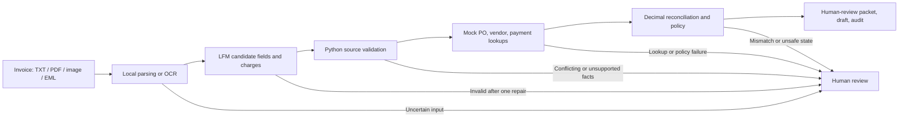

# Demo

This project explores Liquid AI's LFM2.5-2.6B through local inference, LoRA fine-tuning, and a human-reviewed invoice-processing demo. Model-based extraction is paired with deterministic validation, financial calculations, and policy checks.

| Contents | Sections |
|---|---|
| Customer and value | [Project](#project) · [Value proposition](#value-proposition) |
| Demo and controls | [Demo](#demo) · [Workflow](#workflow) |
| Results and plan | [Evidence](#evidence) · [Next steps](#next-steps) |
| Reference | [Repository map](#repository-map) · [Run](#run) |

## Project

I chose carrier-invoice exceptions at a fictional mid-market freight broker. AP staff reconcile invoices with purchase orders, investigate mismatches, and prepare responses.

**Design choice:** LFM2.5-2.6B interprets invoice language locally; deterministic code owns record access, money, policy, and routing. A human retains approval authority.

| Illustrative queue | Example exception | System boundary |
|---|---|---|
| 15,000 invoices/month; 20% exceptions = 3,000 cases. At 8 minutes each and $45/hour: 400 hours and $18,000 monthly labor capacity | $12,375 invoice vs. $12,000 PO; $375 variance exceeds mock $100 tolerance | Proposes $12,000 pending approval and backup; does not decide whether the surcharge is contractually owed |

These volumes, costs, and the proposed one-business-day initial disposition are assumptions for discovery, not customer measurements or an SLA.

## Value proposition

| Potential value | Demonstrated here | Still unproven |
|---|---|---|
| Local capability for sensitive or resource-constrained environments | LFM2.5-2.6B runs locally on both llama.cpp/GGUF and MLX; the MLX path loads a LoRA adapter | Production privacy controls, deployment cost, throughput, or savings |
| Adaptation to a bounded task | Adapter completes tested invoice extraction and produces 89% fewer median tokens than base | Accuracy improvement, prompt-only advantage, or stable speedup |
| Language flexibility alongside explicit controls | LFM proposes fields; Python validates, calculates, and routes | More useful coverage than rules on real, varied invoices |

## Demo

The recommended live example uses the **fine-tuned MLX adapter** on a native-text invoice PDF:

```bash
finetuning/.venv/bin/python finetuning/run_demo.py \
  --invoice part2/artifacts/multiformat/overcharge.pdf
```

For presentation, run only the command above from the repository root. It uses the fine-tuned local model and the MLX runtime; you do not need to start a model server or run any setup command in another terminal. The PDF path is the invoice being demonstrated. The program prints the extracted details, checks, and proposed human-review outcome.

The other model and fixture commands are for optional comparison or testing, not needed for the presentation. A [saved adapter run](finetuning/results/demo.log) is prior evidence, not a live result. The [model-exploration write-up](part1/part1%20write%20up.pdf) records an earlier local Q4_K_M GGUF experiment.

### Reading output

The terminal output leads with the proposed disposition, then shows the extracted facts, arithmetic, and control checks:

```text
Decision: HUMAN_APPROVAL_REQUIRED | amount_mismatch | short_pay
Invoice total: 12375.00 USD
PO total: 12000.00 USD
Variance (invoice - PO): 375.00 USD
Tolerance: 100.00 USD
Line-item total: 12375.00 USD
Auto-post: no
```

`HUMAN_APPROVAL_REQUIRED` means a checked proposal is ready for a person. `HUMAN_REVIEW_REQUIRED` means an exception or failure needs investigation. The packet always reports `Auto-post: no`; it also includes the reason, clerk brief, and email draft. `--verbose` adds full extraction, lookup, and mismatch details. In fixture mode, `[PASS]` means the expected extraction and routing labels matched; it is not a production accuracy estimate.

As a reliability illustration, six independent steps that are each 95% correct yield `0.95^6`, or about 73.5% end-to-end success. This is not a measured reliability estimate; the implementation reduces probabilistic steps with source checks, deterministic policy, bounded repair, and human review.

`--no-brief` skips only optional prose composition; it still requires LFM extraction. Native-text PDFs need no optical character recognition (OCR) setup. OCR converts text in scanned pages or images into machine-readable text. On macOS, image and scanned-PDF intake uses Apple Vision plus Poppler's `pdftoppm`. From the repository root, install Poppler and compile the local helper:

```bash
brew install poppler
mkdir -p part2/.bin
clang -fobjc-arc -framework Foundation -framework Vision -framework CoreGraphics \
  part2/ocr.m -o part2/.bin/local-ocr
export POPPLER_BIN="$(brew --prefix poppler)/bin"
```

Keep `POPPLER_BIN` set in the shell used to run the demo, or add that Poppler bin directory to `PATH`. The helper is macOS-only; native-text PDFs do not invoke it.

## Workflow

The document path separates interpretation from financial authority:

| Scenario | Expected outcome | Demonstrated control |
|---|---|---|
| Overcharge | `amount_mismatch / short_pay` | $375 variance and checked proposal beyond $100 tolerance |
| Unknown PO | `unknown_po / request_information` | Missing record does not become an approval |
| Wrong vendor | `vendor_mismatch / escalate` | Payee must agree with PO vendor |
| Material underbilling | `underbilling / escalate` | Lower invoice is not used to recommend increasing payment |
| Near-tolerance overage | `matched / approve_match` | +$72.50 is within the $100 tolerance |
| Near-tolerance underage | `matched / approve_match` | -$64.40 is within the $100 tolerance |
| Known injection | `prompt_injection / escalate` | Known attack is intercepted before extraction |
| Matched invoice | `matched / approve_match` | Passing checks still require human approval |



| Stage | Owner | Output | Failure response |
|---|---|---|---|
| Intake | Local parser / Vision OCR | Text plus source/page/OCR provenance | Hold unsupported, oversized, ambiguous, or uncertain input |
| Extraction | LFM | Candidate invoice fields and printed charges | Reject malformed/truncated output; allow one repair, then hold |
| Source validation | Python | Supported values with source lines | Hold missing, conflicting, signed/unsupported, or ungrounded facts |
| Record lookup | Python | PO, vendor policy, and paid state | Request information or escalate; invalid lookups require review |
| Reconciliation | Python | Line total, invoice-vs-PO delta, tolerance, route | Deterministic review/approval-required status; never auto-post |
| Handoff | Human + local audit | Rationale, reviewer options, draft, audit packet | Brief falls back to checked template; audit failure is surfaced |

### Tool boundary

In Part 2, LFM makes one structured `submit_extracted_fields` call to return candidate invoice fields and printed charges. That call does not access business systems or choose a payment action. Host Python validates facts against document evidence, calls the mock PO/vendor/paid-invoice lookups, computes amounts with `Decimal`, applies policy, and drafts the vendor email. The optional LFM clerk brief receives only approved sentences. Every proposed outcome remains subject to human approval; the demo captures no approval event and never posts payment.

This is distinct from Part 1's isolated tool-calling experiment: there, LFM chooses `lookup_purchase_order` and supplies its argument, and Python executes the mock lookup. Part 1 demonstrates native model-directed tool selection; Part 2 deliberately narrows the model's tool to structured extraction so that Python owns lookups and decisions. See the [architecture one-pager](ARCHITECTURE.md).

Local OCR is preprocessing for a text model, not a claim of multimodal perception. Missing facts and policy decisions remain with a person.

### Decision tradeoffs

| Decision | Current choice and reason | What could change it |
|---|---|---|
| Read documents | Use native PDF text where available; otherwise local OCR feeds the text model. This keeps the demonstrated inference path local. | A multimodal model is worth testing if it materially improves pixel-level extraction on representative scans without unacceptable deployment or privacy costs. |
| Extract fields | Evaluate LFM for variable language; keep rules for stable, labeled document families. The current rules baseline is strong on this clean synthetic corpus. | Use LFM where a held-out business set shows better useful coverage at an acceptable error and operating cost. |
| Adapt the model | Use LoRA to test compact task-specific extraction, not to teach payment policy. | Keep the adapter only if it beats base and prompt-only alternatives on permissioned, representative cases without increasing incorrect proposals. |
| Decide payment action | Use deterministic policy and keep a human in control; never give the model payment authority. | No model result alone changes this boundary. |

### Escalation recommendation

Escalation to a larger model is **not implemented**. My recommendation is to keep it off by default and evaluate it only for ambiguity that language can resolve from the available evidence.

| Design element | Proposed behavior |
|---|---|
| Trigger | Extraction remains ambiguous after one repair, or a supported multi-document narrative needs interpretation. Unsupported OCR, missing facts, vendor-master conflicts, or policy disagreements go to a person instead. |
| Placement | A larger model acts as a peer candidate extractor, not a policy authority. It returns the same field contract; the same Python source validation, record checks, arithmetic, and human gate still apply. |
| Capability boundary | It receives no payment or email-send tool and cannot bypass required checks. |
| Cost and data | Measure added per-case cost and end-to-end latency. Confirm hosting, retention, and any external data transfer with the customer before enabling it. |
| Evidence gate | Compare rules, base LFM, LoRA, and the larger model on independently labeled held-out cases. Track exact fields, useful coverage, incorrect proposals, escalation rate, latency, and total cost. Enable only if it improves the agreed outcome without breaching safety or data constraints. |

The model ladder is conditional: rules for stable templates; a locally adapted LFM for language variation only where it adds measured value; and a larger model only for a validated long tail. Human review remains the fallback for missing evidence and business authority.

## Evidence

| Evidence | Result | Interpretation |
|---|---|---|
| Local model exploration ([write-up](part1/part1%20write%20up.pdf), [tool code](part1/tool_test.py)) | LFM2.5-2.6B Q4_K_M GGUF on Apple M2/16 GB; short generation 43–46 tokens/s, long-context 25.3 tokens/s, process memory about 2.11–2.13 GB; mock tool loop 4.86s | Hands-on observations, not controlled benchmarks |
| LoRA fine-tuning ([comparison](finetuning/results/comparison.json)) | 60 steps; 96 train / 16 validation / 24 held-out synthetic examples. Base and adapter both exact on 24/24; median tokens 718.5 to 79 (89% reduction) | Compact output with unchanged measured accuracy; no accuracy gain established |
| Timing | Extraction/check median 43.94s base vs. 20.69s adapter, one sequential run under variable machine load | Not a causal or stable speedup; prompt-only shortening was not tested |
| Expanded rules and LFM fixtures | The base-model root fixtures pass 8/8 labels with `part2/run_mvp.py --case all --no-brief`, including +$72.50 and -$64.40 within-tolerance cases; injection skips extraction. On the 32-record multi-format corpus, rules route 32/32; all 28 non-injection documents have exact five-field values and line-item amounts. | All eight scan PDFs route correctly; Apple Vision OCR yields exact fields and line-item amounts on 7/7 non-injection scans. See the [full rules report](review/multiformat-rules-full.json). Stable labels still favor rules; no real-world coverage, production accuracy, SLA, ROI, or model-superiority claim follows |
| Failures that changed the design | A broker heading was initially confused with the carrier; malformed model output could obscure extraction failure; a signed-amount detector once matched a dashed separator | Source-backed payee validation, explicit review on invalid extraction, and line-bounded signed-amount detection now cover these regressions |

### Assumptions revised during the build

| Initial assumption | What testing showed | Revised design |
|---|---|---|
| The most prominent company name on an invoice identifies the payee. | Broker letterhead can differ from the carrier listed as the remittance recipient. | Treat payee as a source-backed fact; validate it against the invoice's `Remit to`, `Vendor`, or `From` evidence and hold conflicts or unsupported values for review. |
| A malformed model response can be repaired or parsed loosely without changing the outcome. | Recovery can hide extraction failure or turn malformed content into unsupported facts. | Accept strict structured output, allow one bounded repair, and fail visibly to human review if validation still fails; do not salvage guessed commercial facts. |
| A plausible amount string is safe to interpret wherever it appears. | Nearby separators and other document text can resemble signed amounts. | Parse amounts only in bounded, labeled source lines, validate the sign and supported currency/format, then do financial arithmetic deterministically with `Decimal`. |

These are implementation assumptions learned from synthetic fixtures and targeted regressions, not claims that the same failure rates have been measured on production invoices.

The format variants are related documents, not independent real-world cases. Raw outputs and training settings are in `finetuning/results/`, `finetuning/data/`, and `finetuning/train.yaml`; benchmark packets and run logs are in `review/`. `review/REVIEW.md` records historical review findings.

The rules baseline succeeds partly because these generated invoices have stable labels and separated tabular schedules. The corpus covers eight business cases, 32 files, and three related layout variants across PDF, PNG, scanned PDF, and EML. The [full rules report](review/multiformat-rules-full.json) records this run against the current manifest, including its hash, per-document outcomes, and OCR provenance. The corpus tests integration and tolerance boundaries, not broad accuracy on independently collected business cases.

## Next steps

| Priority | Evaluation | Evidence needed |
|---:|---|---|
| 1 | Compare rules, base LFM, prompt-only compact output, and LoRA on permissioned real invoices split by vendor/layout | Independent labels and representative held-out cases |
| 2 | Repeat performance measurements | Fixed hardware, warm-up, randomized order, end-to-end latency, utilization, and cost |
| 3 | Run in AP shadow mode | Reviewer corrections, useful coverage, active handling time, and incorrect-proposal rate |
| 4 | Evaluate OCR on degraded real documents | Pixel-level transcription review; ambiguous evidence remains a human hold |
| 5 | Consider an approved larger model only for residual language ambiguity | Same evidence validation and human authority; no silent fallback or invented facts |

The illustrative ROI scenario assumes 60% useful coverage and a reduction from 8 to 3 human minutes on covered cases, yielding 150 hours/month of released capacity. It is a pilot hypothesis, not measured savings. See `part2/roi.py` and `part2/pilot_measurements.csv`.

## Repository map

```text
README.md                              This single technical guide
part1/                                Local model exploration report and tool-call code
part2/                                Invoice agent, fixtures, tests, ingestion, policy
finetuning/                           MLX LoRA training, adapter demo, data and results
review/                               Saved evaluations, traces, and historical review
```

| Area | Key files | Purpose |
|---|---|---|
| Model exploration | `part1/part1 write up.pdf`, `part1/tool_test.py` | Local model measurements and actual tool call |
| Invoice workflow | `part2/run_mvp.py`, `part2/agent.py` | CLI and orchestration |
| Safety/policy | `part2/validation.py`, `part2/backends.py` | Source checks, records, money and routing |
| Ingestion | `part2/ingestion.py`, `part2/ocr.m` | PDF/email parsing and local macOS Vision OCR |
| Fine-tuning | `finetuning/run_demo.py`, `finetuning/train.yaml` | Adapter demo and LoRA configuration |
| Evaluation | `part2/test_agent.py`, `part2/test_ingestion.py`, `finetuning/results/` | Offline checks and recorded experiments |

## Run

Install the base workflow dependencies in `.venv` from the repo root:

```bash
python3 -m venv .venv
.venv/bin/python -m pip install -r part2/requirements.txt
.venv/bin/python -m unittest discover -s part2 -p 'test_*.py' -v
```

The MLX demo uses the separate `finetuning/.venv`, downloaded MLX-format model, and adapter. Setup/training commands and pinned dependencies are in `finetuning/requirements-lock.txt`, `finetuning/download_model.py`, and `finetuning/train.yaml`. The llama.cpp demo requires a locally installed server and GGUF. No cloud API key or remote inference fallback is used.

Inputs are capped at 10 MiB/document, five PDF pages, and 24,000 combined text characters. Current financial policy supports USD, nonnegative cent amounts, labeled payees/totals, and `PO-<digits>` / `INV-<alphanumeric>` identifiers. OCR is currently macOS Vision; this implementation is not cross-platform.
